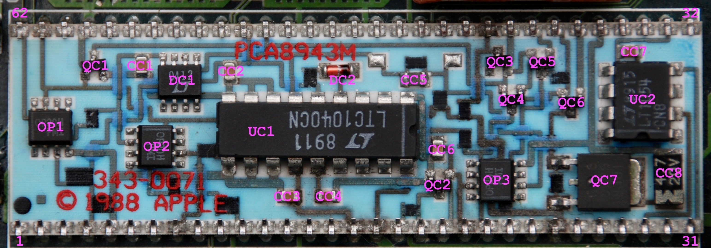
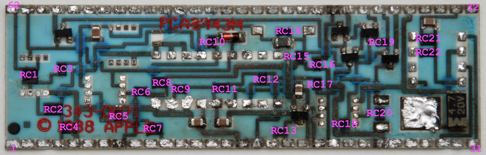
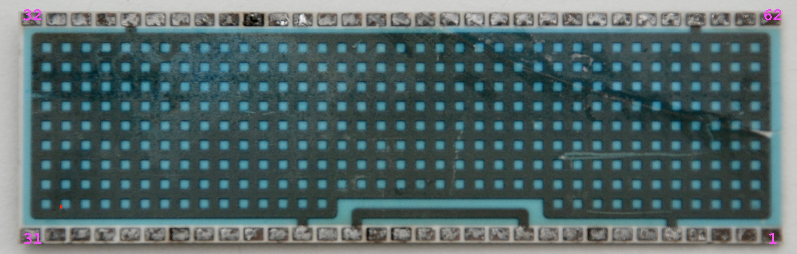

# macintosh-portable
This is an attempt to reverse-engineer **Macintosh Portable** motherboard's power distribution and management subsystem.

* The files can be opened and edited using [KiCad](http://www.kicad-pcb.org/).
* Check out the [PDF releases](https://github.com/ppieczul/macintosh-portable/releases) of the schematics.
* You may take a look at my collection of vintage computers: [oldcrap.org](https://oldcrap.org)

Pictures of the **V1M hybrid** board with marked components:

