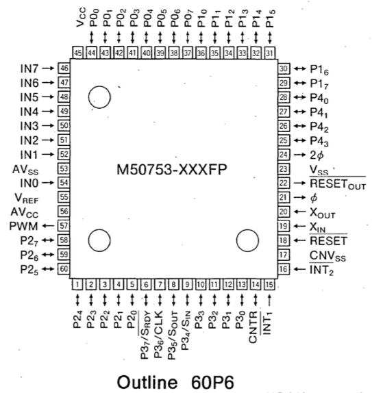
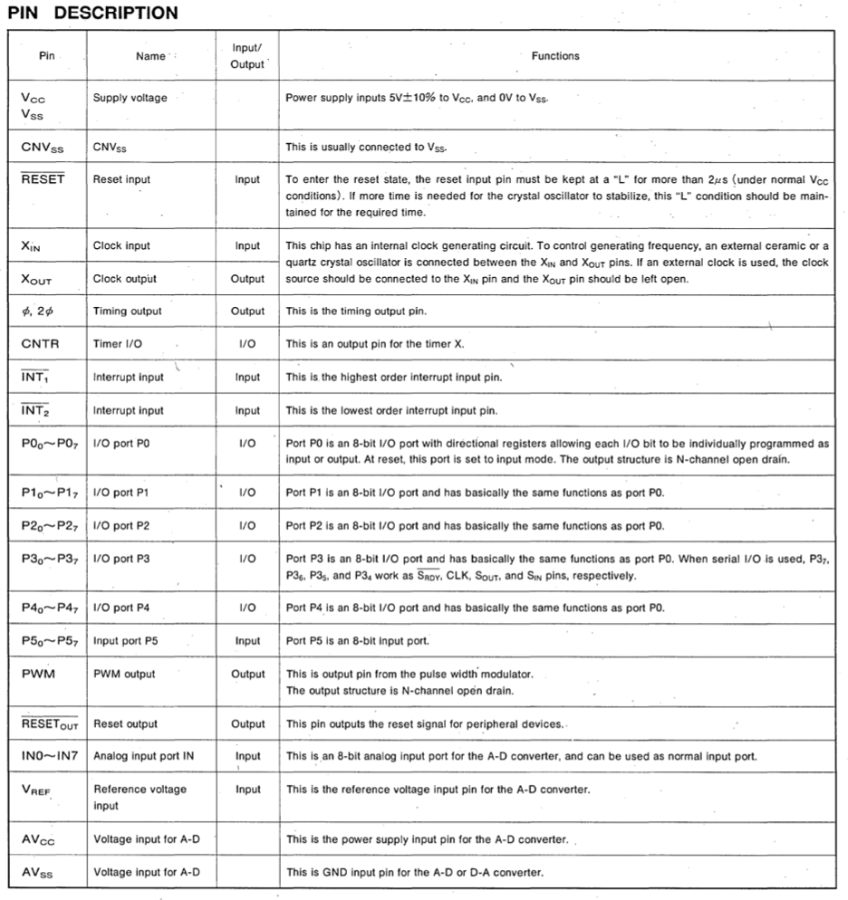
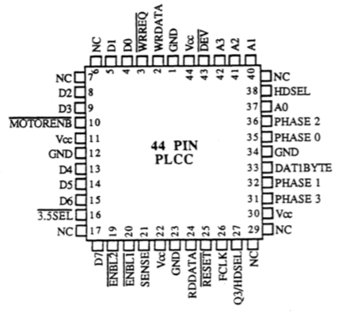
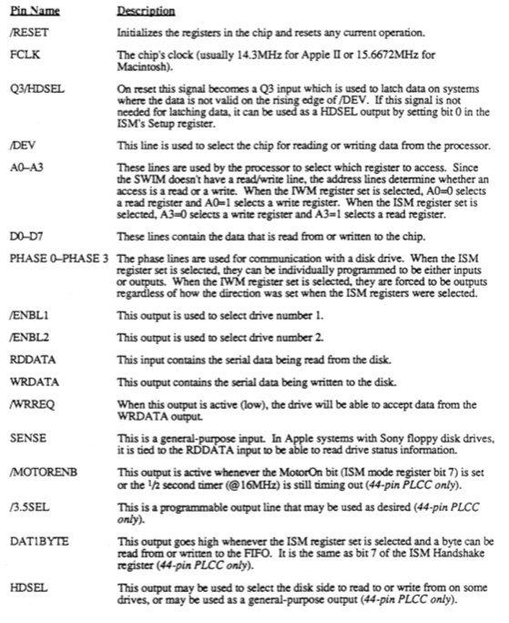
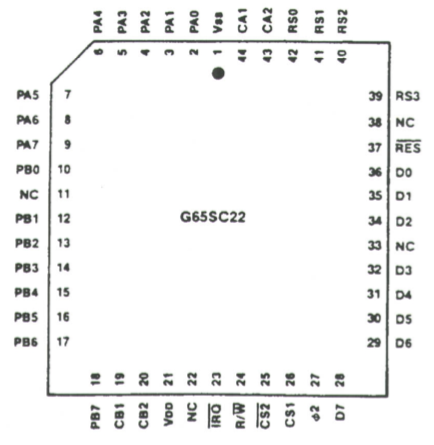
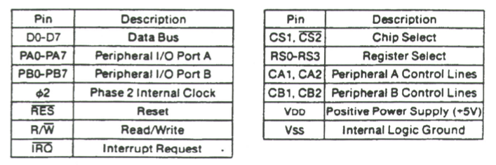

# macintosh-portable

## Attention!

The original Macintosh Portable have finally surfaced. They can be found here:

  * [nicpunt github](https://github.com/nickpunt/nubus-se30/tree/master/Schematics/apple)
  * [archive.org](https://archive.org/details/Macintosh68kSchematics)

## Introduction

This is an attempt to reverse-engineer **Macintosh Portable** motherboard's power distribution and management subsystem.

* The files can be opened and edited using [KiCad](http://www.kicad-pcb.org/).
* Check out the [PDF releases](https://github.com/ppieczul/macintosh-portable/releases) of the schematics.
* You may take a look at my collection of vintage computers: [oldcrap.org](https://oldcrap.org)

## V1M Hybrid Board

## Apple Power Manager Chip (PMGR)

This is [Mitsubishi M50753](http://www.bitsavers.org/components/mitsubishi/_dataBooks/1989_Mitsubishi_Single-Chip_8-Bit_Microcomputers.pdf) Microcontroller with embedded EPROM.

## Apple Sander-Wozniak Integrated Machine (SWIM)

This is a floppy controller chip, full chip spec is [here](http://dec8.info/Apple/Apple%20Floppy%20Notes/SWIM%20Chip%20User's%20Ref.pdf). Pin 0 is in the top row of the chip, considering how the text is printed on it.

## Versatile Interface Adapter (VIA)

This is G65SC22PE-2, full chip spec is [here](http://datasheet.elcodis.com/pdf2/74/25/742581/g65sc22p-3.pdf).

